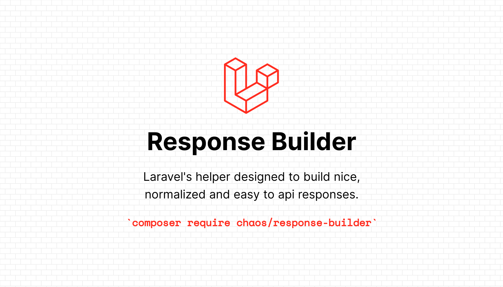

## Response Builder for Laravel API

ResponseBuilder is Laravel's helper designed to build nice, normalized and easy to consume REST API JSON responses.

## Requirement

> Laravel >= 5.6
>
>  Php >= 7.1

## Installation

You can install the package via composer:

```bash
$ composer require ibrahimhalilucan/response-builder
```

### Exposed Methods

#### success
- Parameter `null|mixed $data`
- Return `return \IbrahimHalilUcan\ResponseBuilder\ResponseBuilder`
#### error
- Parameter `null|mixed $data`
- Return `return \IbrahimHalilUcan\ResponseBuilder\ResponseBuilder`
#### message
- Parameter `string $message`
- Return `@return \IbrahimHalilUcan\ResponseBuilder\ResponseBuilder`
#### httpHeaders
- Parameter `array $httpHeaders`
- Return `@return \IbrahimHalilUcan\ResponseBuilder\ResponseBuilder`
#### httpStatusCode
- Parameter `int $httpStatusCode`
- Return `@return \IbrahimHalilUcan\ResponseBuilder\ResponseBuilder`
#### append
- Parameter `array $data`
- Return `@return \IbrahimHalilUcan\ResponseBuilder\ResponseBuilder`
#### build
- Return `@return \Illuminate\Http\JsonResponse`

## Usage

### Example 1

```php
use IbrahimHalilUcan\ResponseBuilder\Facades\ResponseBuilder;

$items = [1, 2, 3, 4];
return ResponseBuilder::success($items)->build();
```

See response below:

```text
{
    "meta": {
        "status": true,
        "code": 200,
        "message": "OK"
    },
    "data": [1,2,3,4,5]
}
```

### Example 2

```php
use IbrahimHalilUcan\ResponseBuilder\Facades\ResponseBuilder;
use Symfony\Component\HttpFoundation\Response;

$items = [1, 2, 3, 4];
return ResponseBuilder::success($items)
    ->message('Result Message')
    ->append(['custom-key' => 'value'])
    ->httpStatusCode(Response::HTTP_OK)
    ->build();
```

See response below:

```text
{
    "meta": {
        "status": true,
        "code": 200,
        "message": "Result Message"
    },
    "data": [1,2,3,4,5],
    "custom-key": "value"
}
```

### Example 3

```php
use IbrahimHalilUcan\ResponseBuilder\Facades\ResponseBuilder;

$items = Blog::where('status', 1)->get();
return ResponseBuilder::success($items, BlogResource::class)
    ->message('Active Blog Lists')
    ->append(['custom-key' => 'value'])
    ->build();
```

See response below:

```text
{
    "meta": {
        "status": true,
        "code": 200,
        "message": "Active Blog Lists"
    },
    "data": [
        {
            "id": 1,
            "title": "Lorem Ipsum 1",
            "description": "Lorem ipsum dolor sit amet, consectetur adipiscing elit, sed do eiusmod tempor incididunt ut labore et dolore magna aliqua. Ut enim ad minim veniam, quis nostrud exercitation ullamco laboris nisi ut aliquip ex ea commodo consequat. Duis aute irure dolor in reprehenderit in voluptate velit esse cillum dolore eu fugiat nulla pariatur. Excepteur sint occaecat cupidatat non proident, sunt in culpa qui officia deserunt mollit anim id est laborum.",
            "published_at": "2022-12-03 18:09:21",
            "created_at": "2022-12-03 18:09:21" 
        },
        {
            "id": 2,
            "title": "Lorem Ipsum 2",
            "description": "Lorem ipsum dolor sit amet, consectetur adipiscing elit, sed do eiusmod tempor incididunt ut labore et dolore magna aliqua. Ut enim ad minim veniam, quis nostrud exercitation ullamco laboris nisi ut aliquip ex ea commodo consequat. Duis aute irure dolor in reprehenderit in voluptate velit esse cillum dolore eu fugiat nulla pariatur. Excepteur sint occaecat cupidatat non proident, sunt in culpa qui officia deserunt mollit anim id est laborum.",
            "published_at": "2022-12-03 18:19:35",
            "created_at": "2022-12-03 18:19:35" 
        },
    ],
    "custom-key": "value"
}
```

### Example 4
```php
use IbrahimHalilUcan\ResponseBuilder\Facades\ResponseBuilder;

$items = Blog::paginate();
return ResponseBuilder::success($items, BlogResource::class)
    ->message('Blog Lists')
    ->build();
```

See response below:

```text
{
    "meta": {
        "status": true,
        "code": 200,
        "message": "Blog Lists"
    },
    "data": [
        {
            "id": 1,
            "title": "Lorem Ipsum 1",
            "description": "Lorem ipsum dolor sit amet, consectetur adipiscing elit, sed do eiusmod tempor incididunt ut labore et dolore magna aliqua. Ut enim ad minim veniam, quis nostrud exercitation ullamco laboris nisi ut aliquip ex ea commodo consequat. Duis aute irure dolor in reprehenderit in voluptate velit esse cillum dolore eu fugiat nulla pariatur. Excepteur sint occaecat cupidatat non proident, sunt in culpa qui officia deserunt mollit anim id est laborum.",
            "published_at": "2022-12-03 18:09:21",
            ""created_at"": "2022-12-03 18:09:21" 
        },
        {
            "id": 2,
            "title": "Lorem Ipsum 2",
            "description": "Lorem ipsum dolor sit amet, consectetur adipiscing elit, sed do eiusmod tempor incididunt ut labore et dolore magna aliqua. Ut enim ad minim veniam, quis nostrud exercitation ullamco laboris nisi ut aliquip ex ea commodo consequat. Duis aute irure dolor in reprehenderit in voluptate velit esse cillum dolore eu fugiat nulla pariatur. Excepteur sint occaecat cupidatat non proident, sunt in culpa qui officia deserunt mollit anim id est laborum.",
            "published_at": "2022-12-03 18:19:35",
            "created_at": "2022-12-03 18:19:35" 
        },
    ],
    "pagination": {
        "total": 60,
        "per_page": 10,
        "current_page": 1,
        "last_page": 6,
        "count": 10,
        "from": 1,
        "to":10,
        "links": [
            {
                "url": null,
                "label": "&laquo; Previous",
                "active": false
            },
            {
                "url": "your_app_url?page=1",
                "label": "1",
                "active": true
            },
            {
                "url": "your_app_url?page=2",
                "label": "2",
                "active": false
            },
            {
                "url": "your_app_url?page=3",
                "label": "3",
                "active": false
            },
            {
                "url": "your_app_url?page=4",
                "label": "4",
                "active": false
            },
            {
                "url": null,
                "label": "...",
                "active": false
            },
            {
                "url": "your_app_url?page=2",
                "label": "Next &raquo;",
                "active": false
            }
        ]
    }
}
```

### Example 5

```php
use IbrahimHalilUcan\ResponseBuilder\Facades\ResponseBuilder;

$items = [
    'device_id'     => "26728172-d050-4126-8ee2-4bfe8201565c",
    'secret'        => "0184cd97-7351-7121-91cb-5a818f3eb4b0",
    'platform'      => "iOS",
    'version'       => "1.0",
    'language_code' => "en",
    'country_code'  => "TR",
    'time_zone'     => "Europe/Istanbul",
];

$validator = Validator::make($items, [
    'device_id' => 'required|size:12', // device length should be 12 chars
    'secret'    => 'required',
    'platform'  => ['required', Rule::in('Android', 'iOS', 'Huawei')],
]);

return ResponseBuilder::error($validator->errors())->build();

```

See response below:

```text
{
    "meta": {
        "status": false,
        "code": 422,
        "message": "Error"
   },
   "errors": {
        "device_id": ["The device id must be 12 characters."]
   }
}
```

### Example 6
```bash

use  IbrahimHalilUcan\Traits\FailedValidationTrait;


class BlogRequest extends Request {

    use FailedValidationTrait;
    .
    .

}
```

See response below:

```text
{
    "meta": {
        "status": false,
        "code": 422,
        "message": "Error"
   },
   "errors": {
        "device_id": ["The device id must be 12 characters."]
   }
}
```

### Example 7

```php
use IbrahimHalilUcan\ResponseBuilder\Facades\ResponseBuilder;

return ResponseBuilder::noContent()->build();
```

See response below:

```text
{
    "meta": {
        "status": true,
        "code": 204,
        "message": "OK"
    },
    "data": null
}
```

## Changelog

Please see [CHANGELOG](CHANGELOG.md) for more information what has changed recently.

## Contributing
Any ideas are welcome. Feel free to submit any issues or pull requests.
Please see [CONTRIBUTING](CONTRIBUTING.md) for details.

## Security

If you discover any security related issues, please email ibrahimhalilucan@gmail.com instead of using the issue tracker.

## Credits

- [İbrahim Halil Uçan](https://github.com/ibrahimhalilucan)

## License

The MIT License (MIT). Please see [License File](LICENSE) for more information.
